# XFingerCrack - Typing Test Application

<p align="center">
  <a href="https://github.com/xaprier/XFingerCrack/blob/main/LICENSE" target="blank">
    
  </a>
  <a href="https://github.com/xaprier/XFingerCrack/actions" target="blank">
    
  </a>
  <a href="https://xaprier.github.io/XFingerCrack/" target="blank">
    
  </a>
  <a href="https://github.com/xaprier/XFingerCrack/releases" target="blank">
    
  </a>
</p>

## Overview

XFingerCrack is a modern, feature-rich typing test application built with Qt6 and QML. It provides comprehensive metrics for measuring and improving typing speed and accuracy, with support for multiple languages, customizable themes, and detailed performance analytics. Inspired by [MonkeyType](https://github.com/monkeytypegame/monkeytype)

📚 **[View API Documentation](https://xaprier.github.io/XFingerCrack/)**

## Features

### Core Functionality
- **Dual Test Modes**: Support for both time-based and word-count-based typing tests
- **Real-time Metrics**: Live WPM (Words Per Minute) and accuracy tracking during tests
- **Performance Graph**: Visual representation of typing speed throughout the test duration
- **Character Analysis**: Detailed character-by-character accuracy statistics
- **Test History**: SQLite-based persistent storage of all test results with comprehensive filtering

### User Experience
- **Multi-language Support**: Available in English, Turkish, German
- **Customizable Themes**: Multiple light and dark theme options
- **Sound Effects**: Configurable keyboard click sounds and error notifications
- **Keyboard Navigation**: Full keyboard shortcuts for efficient workflow

### Advanced Features
- **Word Generator**: Language-specific word lists including general vocabulary and programming keywords(took from [MonkeyType](https://github.com/monkeytypegame/monkeytype))
- **Statistics Dashboard**: Average WPM, total tests, current streak tracking
- **Test Filtering**: Filter history by mode, and duration
- **Best Results**: Track and display top performances for both test modes

## Requirements

### Runtime Dependencies
- Qt 6.10.2 or higher
  - Qt Core
  - Qt Quick
  - Qt QML
  - Qt Charts
  - Qt Widgets
  - Qt Multimedia
  - Qt SQL
- SQLite 3

### Build Dependencies
- CMake 3.16 or higher
- Google Test (automatically fetched via CMake)

## Building from Source

### Clone the Repository

```bash
git clone https://github.com/xaprier/XFingerCrack.git
cd XFingerCrack
```

### Configure and Build

```bash
# Create build directory
mkdir build && cd build

# Configure with CMake
cmake ..

# Build the project
cmake --build .

# Optional: Run tests
ctest --output-on-failure
```

### Build Options

```bash
# Release build with optimizations
cmake -DCMAKE_BUILD_TYPE=Release ..

# Debug build with symbols
cmake -DCMAKE_BUILD_TYPE=Debug ..

# Specify custom Qt installation
cmake -DCMAKE_PREFIX_PATH=/path/to/Qt/6.10.2/gcc_64 ..
```

## Installation

### From Build Directory

```bash
# Install to system (requires root/sudo)
sudo cmake --install .

# Install to custom location
cmake --install . --prefix /path/to/install
```

### Running the Application

```bash
# From build directory
./fingercrack

# After system installation
fingercrack
```

## Usage

### Quick Start

1. **Select Test Mode**: Choose between Time-based or Words-based mode from the toolbar
2. **Configure Settings**: Set duration/word count, language, and theme preferences
3. **Start Typing**: Click on the typing area and begin typing the displayed text
4. **View Results**: After completion, review detailed statistics and performance graphs
5. **Track Progress**: Access history to monitor improvement over time

### Keyboard Shortcuts

- `Tab`: Start new test
- `Esc`: Stop current test
- `Enter`: Restart test (from results screen)
- `Ctrl+H`: Open history view
- `Ctrl+S`: Open settings
- `Ctrl+Q`: Quit application

### Test Configuration

#### Time-Based Mode
- Available durations: 15s, 30s, 60s, 120s
- Tests run for the specified duration
- Real-time countdown display

#### Words-Based Mode
- Available word counts: 10, 25, 50, 100
- Tests complete after typing the specified number of words
- Progress indicator shows remaining words

## Project Structure

```
fingercrack/
├── include/              # Header files
│   ├── AppInfo.hpp
│   ├── ConfigManager.hpp
│   ├── TestHistory.hpp
│   ├── TestResult.hpp
│   ├── ThemeManager.hpp
│   ├── TranslationManager.hpp
│   ├── TypingTest.hpp
│   └── WordGenerator.hpp
├── src/                  # Implementation files
│   ├── AppInfo.cpp
│   ├── ConfigManager.cpp
│   ├── main.cpp
│   ├── TestHistory.cpp
│   ├── TestResult.cpp
│   ├── ThemeManager.cpp
│   ├── TranslationManager.cpp
│   ├── TypingTest.cpp
│   ├── WordGenerator.cpp
│   └── XFingerCrackApplication.cpp
├── qml/                  # QML UI files
│   ├── components/       # Reusable UI components
│   ├── pages/           # Main application pages
│   └── main.qml
├── resources/           # Application resources
│   ├── sounds/          # Audio effects
│   ├── themes.json      # Theme definitions
│   ├── translations/    # UI translations
│   └── wordlist/        # Language-specific word lists
├── tests/               # Unit tests
│   ├── test_configmanager.cpp
│   ├── test_testhistory.cpp
│   ├── test_typingtest.cpp
│   └── test_wordgenerator.cpp
└── CMakeLists.txt       # Build configuration
```

## Architecture

### Core Components

**AppInfo**: Application metadata provider for version information and URLs

**ConfigManager**: Settings persistence using QSettings, manages user preferences

**ThemeManager**: JSON-based theme loading and management system

**TranslationManager**: Multi-language support with Qt Linguist integration

**WordGenerator**: Language-specific word generation from JSON wordlists

**TypingTest**: Core test logic, input processing, and metrics calculation

**TestResult**: Test data collection, analysis, and statistics generation

**TestHistory**: SQLite database interface for persistent test storage

### Design Patterns

- **Singleton**: Used for application-wide managers (ConfigManager, ThemeManager)
- **Observer**: Qt signals/slots for reactive UI updates
- **Model-View**: Separation of business logic (C++) from UI (QML)
- **Strategy**: Pluggable word generators for different languages

### Documentation

Generate API documentation using Doxygen:

```bash
# Generate documentation
doxygen Doxyfile

# Documentation will be generated in docs/html/
# Open in browser
firefox docs/html/index.html
# or
xdg-open docs/html/index.html
```

The documentation includes:
- Complete API reference for all classes
- Detailed method and parameter descriptions
- Class hierarchy and inheritance diagrams
- Cross-referenced source code
- File structure overview

### Testing

```bash
# Run all tests
cd build
ctest

# Run specific test suite
./fingercrack_tests --gtest_filter=ConfigManagerTest.*

# Run with verbose output
ctest --verbose

# Generate coverage report (if configured)
cmake -DCMAKE_BUILD_TYPE=Coverage ..
make coverage
```

### Creating Custom Themes

Edit `resources/themes.json` to add new themes:

```json
{
  "id": "custom-theme",
  "name": "Custom Theme",
  "background": "#000000",
  "surface": "#1a1a1a",
  "text": "#ffffff",
  "textSecondary": "#888888",
  "accent": "#007acc",
  "correct": "#00ff00",
  "incorrect": "#ff0000",
  "border": "#333333"
}
```

## Contributing

Contributions are welcome. Please follow these guidelines:

1. Fork the repository
2. Create a feature branch (`git checkout -b feature/amazing-feature`)
3. Follow the existing code style and conventions
4. Add tests for new functionality
5. Ensure all tests pass (`ctest`)
6. Commit with clear, descriptive messages
7. Push to your fork and submit a pull request

## License

This project is licensed under the GNU GPLv3 License - see the [LICENSE](LICENSE) file for details.

## Screenshots

All the UI and theming screenshots can be found in the [assets/screenshots](assets/screenshots) directory.

### Themes

| Ayu Light | GitHub Light | Solarized Light |
|-----------|--------------|-----------------|
| 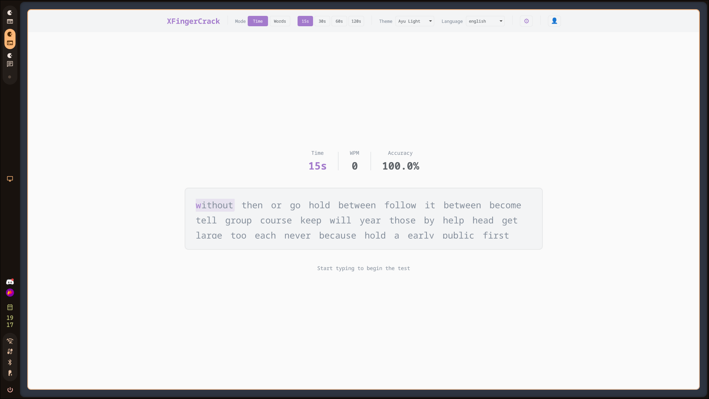 | 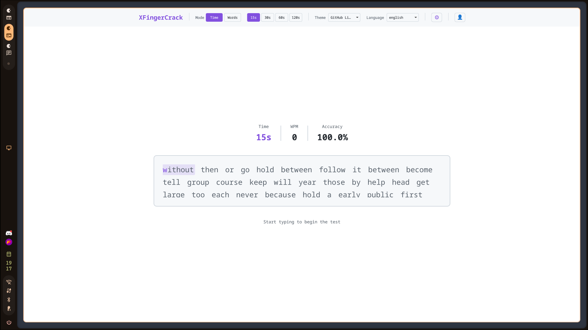 | 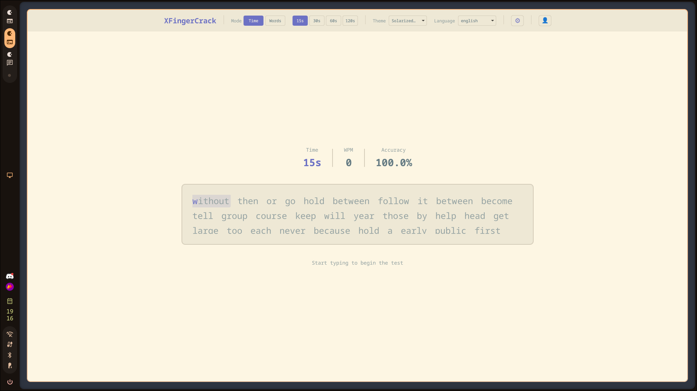 |

| Catppuccin Mocha | Dracula | Nord |
|------------------|---------|------|
| 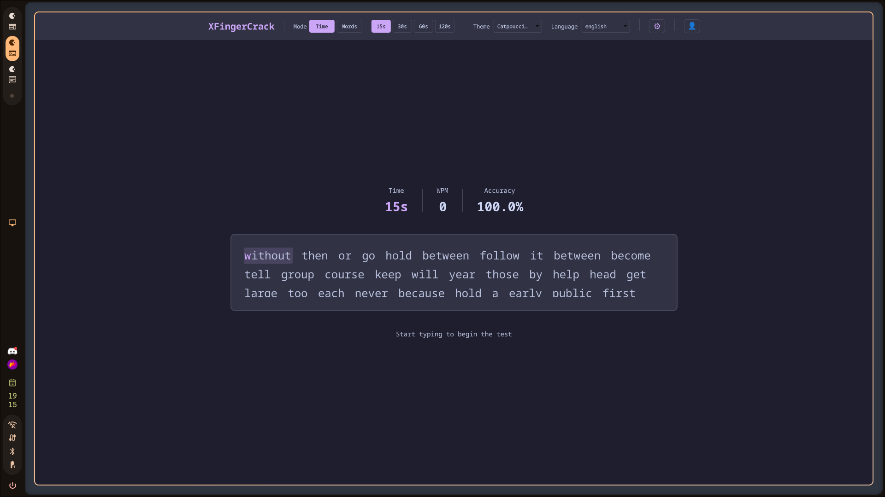 | 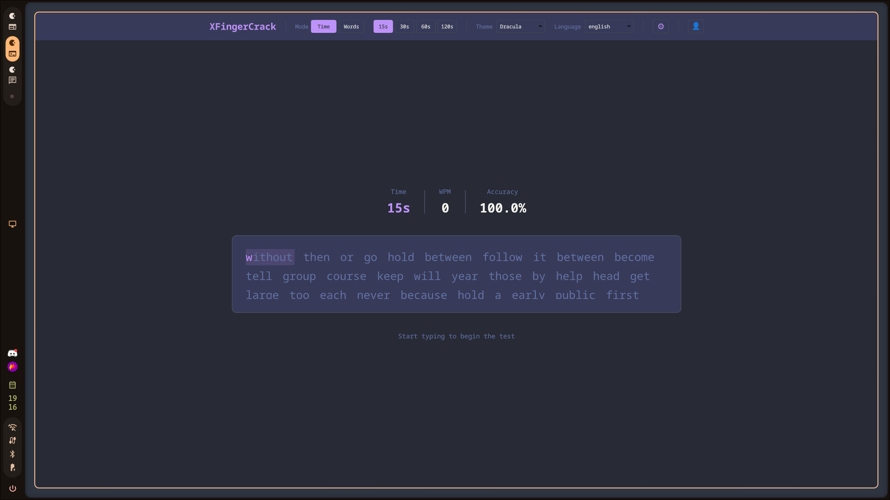 | 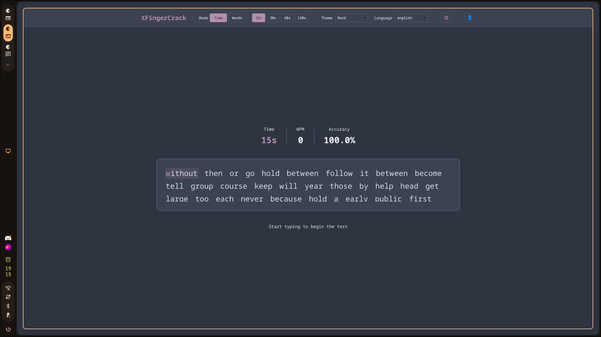 |

| Everforest | Gruvbox Dark | One Dark |
|------------|--------------|-------------|
| 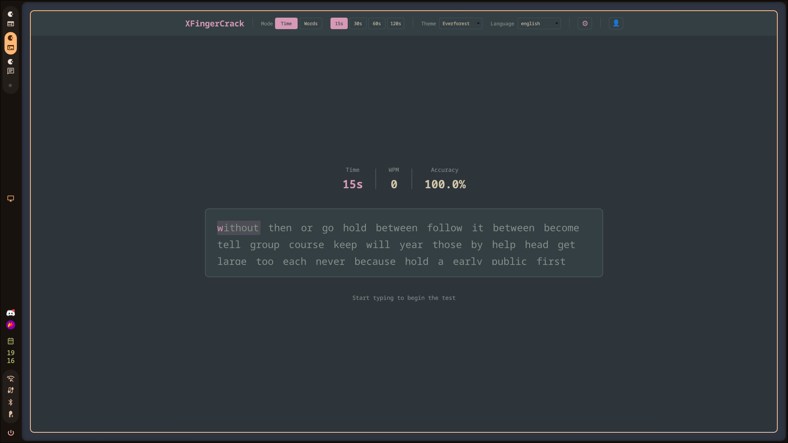 | 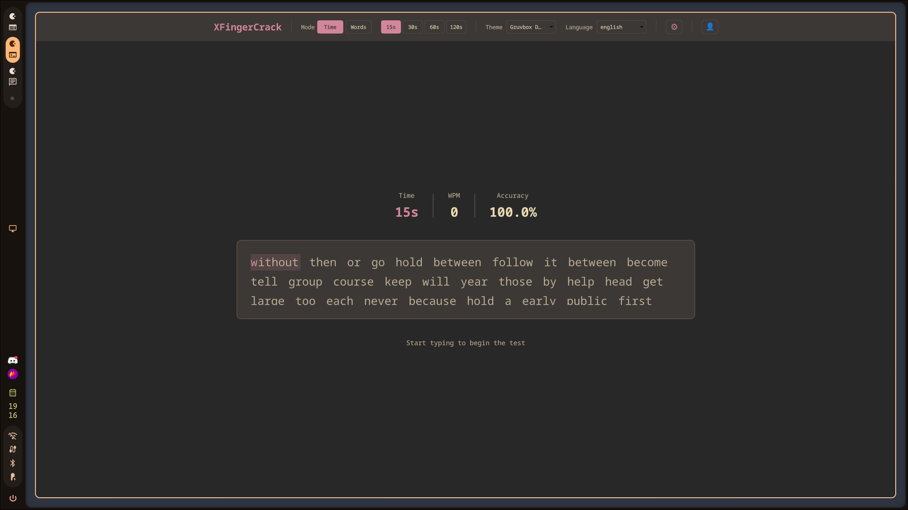 | 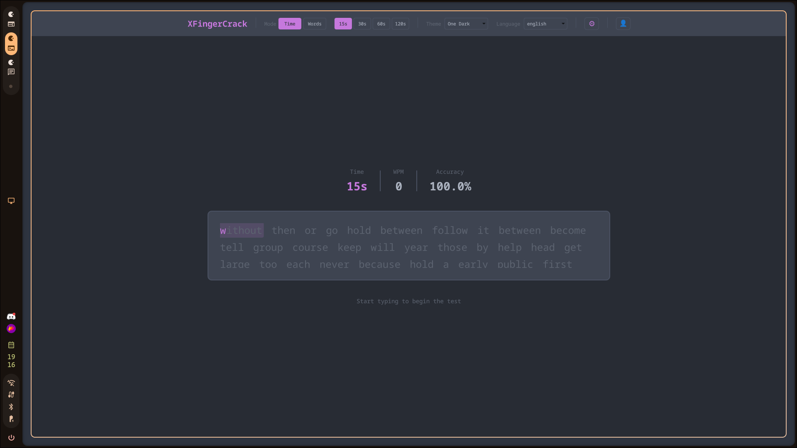 |

| Rose Pine | Tokyo Night | Moonlight |
|-----------|-------------|-----------|
| 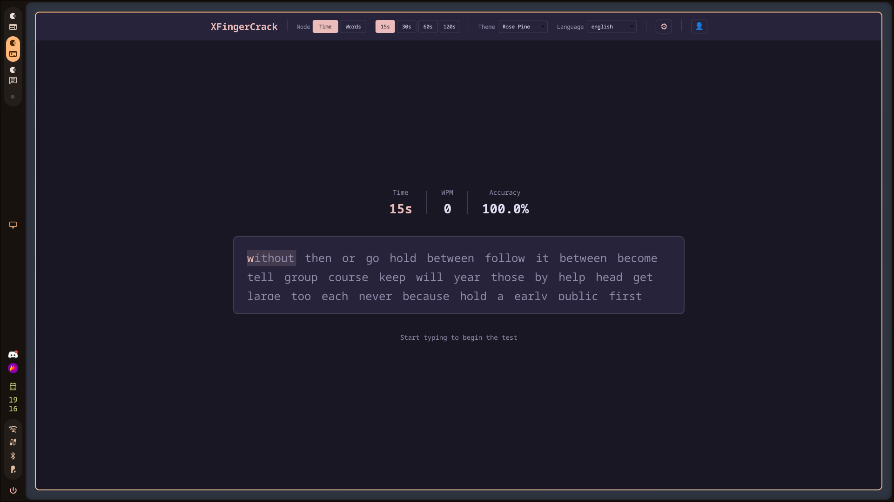 | 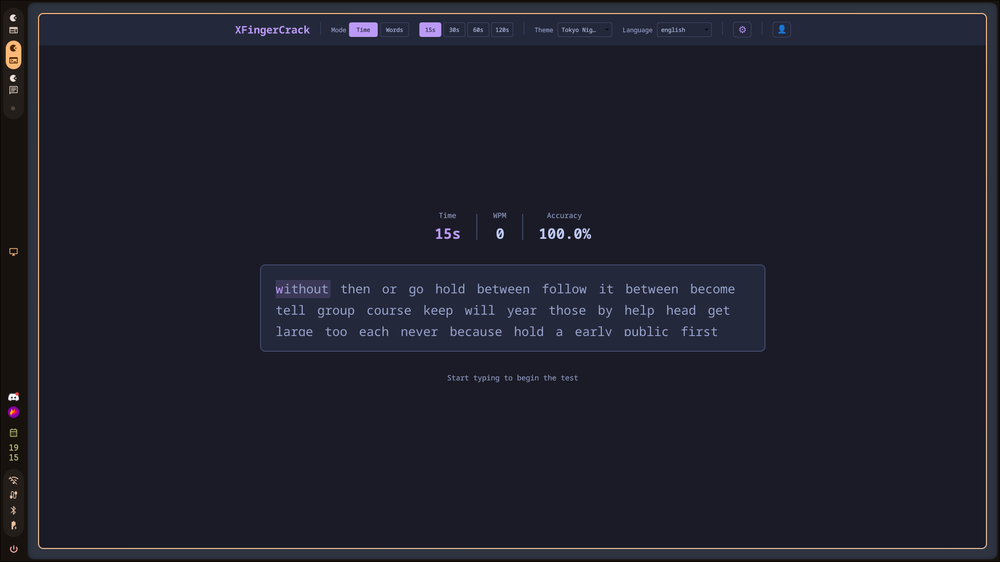 | 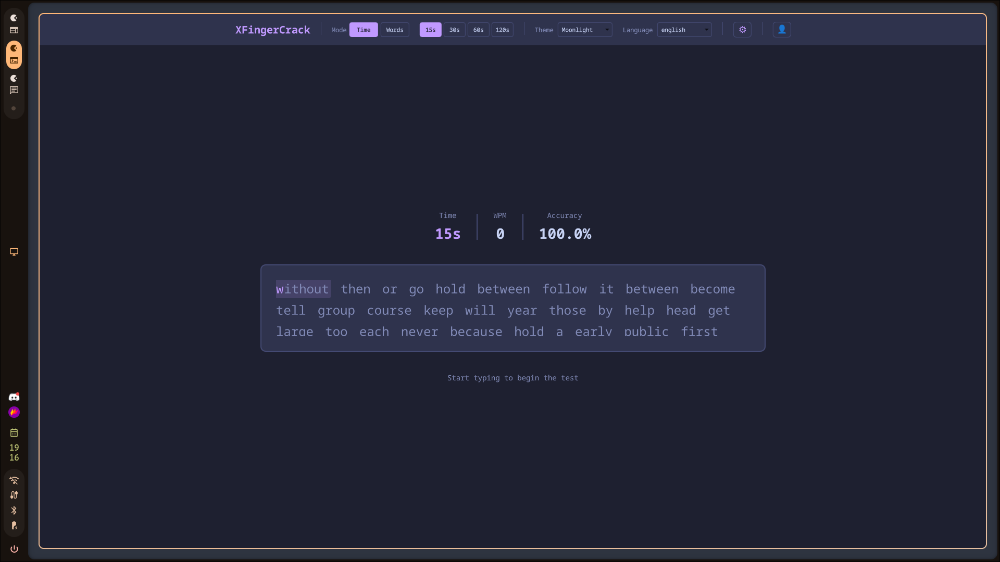 |

### UI
| Test Screen | Result Screen | Settings |
|-------------|---------------|----------|
|  | 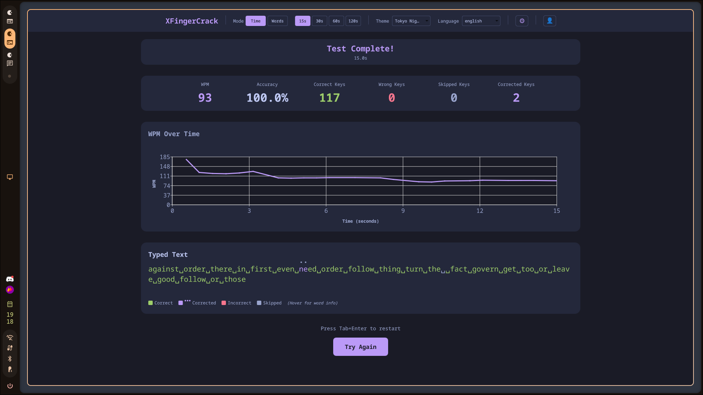 | 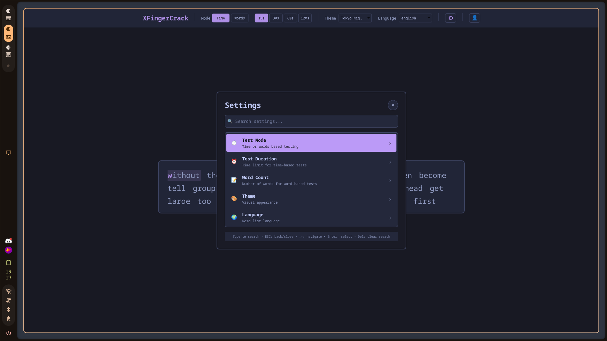 |

| History - Recent Tests | History - Statistics | History - Best Results |
|-----------------------|----------------------|-----------------------|
| 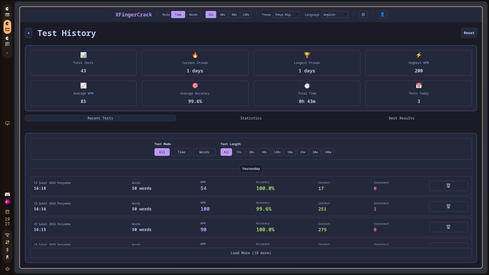 | 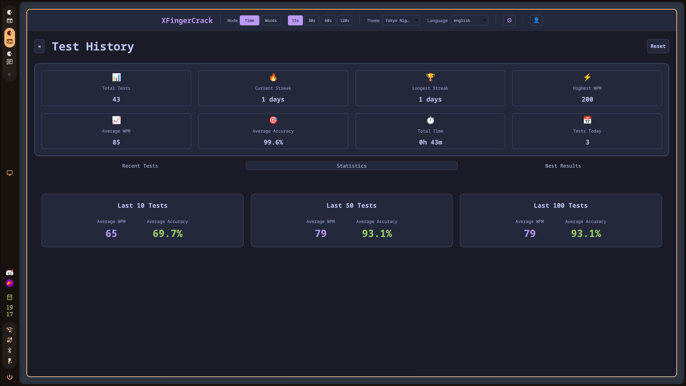 | 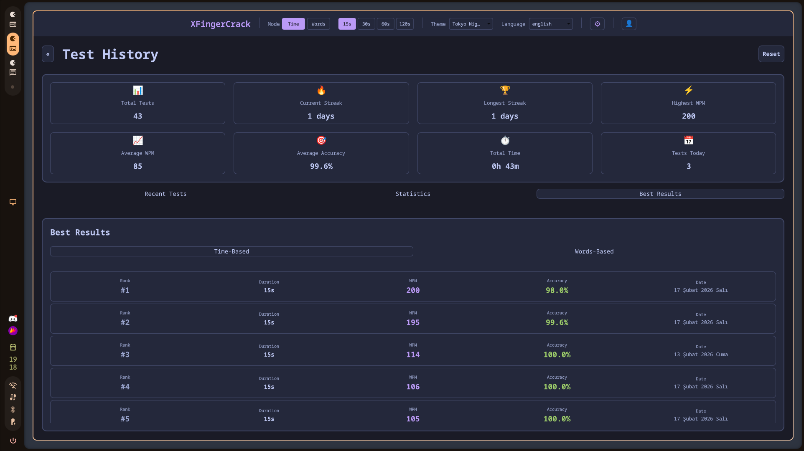 |
